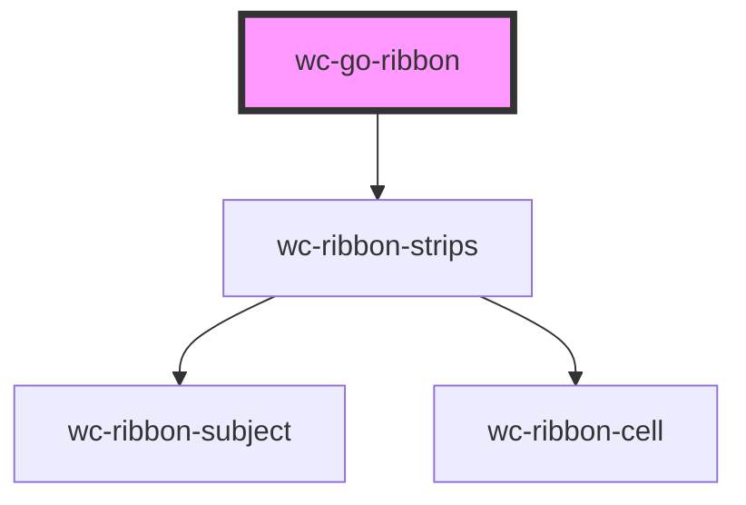

# wc-go-ribbon

<!-- Auto Generated Below -->

## Properties

| Property                | Attribute                   | Description                                                                                                                                                                                                                                                              | Type      | Default                                               |
| ----------------------- | --------------------------- | ------------------------------------------------------------------------------------------------------------------------------------------------------------------------------------------------------------------------------------------------------------------------ | --------- | ----------------------------------------------------- |
| `addCellAll`            | `add-cell-all`              | add a cell at the beginning of each row/subject to show all annotations                                                                                                                                                                                                  | `boolean` | `true`                                                |
| `annotationLabels`      | `annotation-labels`         |                                                                                                                                                                                                                                                                          | `string`  | `"annotation,annotations"`                            |
| `baseApiUrl`            | `base-api-url`              |                                                                                                                                                                                                                                                                          | `string`  | `"http://api.geneontology.org/api/ontology/ribbon/"`  |
| `binaryColor`           | `binary-color`              | false = show a gradient of colors to indicate the value of a cell true = show only two colors (minColor; maxColor) to indicate the values of a cell                                                                                                                      | `boolean` | `false`                                               |
| `categoryAllStyle`      | `category-all-style`        | 0 = Normal 1 = Bold                                                                                                                                                                                                                                                      | `any`     | `FONT_STYLE.NORMAL`                                   |
| `categoryCase`          | `category-case`             | Override of the category case 0 (default) = unchanged 1 = to lower case 2 = to upper case                                                                                                                                                                                | `any`     | `FONT_CASE.LOWER_CASE`                                |
| `categoryOtherStyle`    | `category-other-style`      | 0 = Normal 1 = Bold                                                                                                                                                                                                                                                      | `any`     | `FONT_STYLE.NORMAL`                                   |
| `classLabels`           | `class-labels`              |                                                                                                                                                                                                                                                                          | `string`  | `"term,terms"`                                        |
| `colorBy`               | `color-by`                  | Which value to base the cell color on 0 = class count 1 = annotation count                                                                                                                                                                                               | `any`     | `COLOR_BY.ANNOTATION_COUNT`                           |
| `data`                  | `data`                      | if provided, will override any value provided in subjects and subset                                                                                                                                                                                                     | `string`  | `undefined`                                           |
| `excludePB`             | `exclude-p-b`               |                                                                                                                                                                                                                                                                          | `boolean` | `true`                                                |
| `filterBy`              | `filter-by`                 | Filter rows based on the presence of one or more values in a given column The filtering will be based on cell label or id Example: filter-by="evidence:ISS,ISO or multi-step filters: filter-by:evidence:ISS,ISO;term:xxx" Note: if value is "", remove any filtering    | `string`  | `undefined`                                           |
| `filterCrossAspect`     | `filter-cross-aspect`       |                                                                                                                                                                                                                                                                          | `boolean` | `true`                                                |
| `filterReference`       | `filter-reference`          |                                                                                                                                                                                                                                                                          | `string`  | `"PMID:,DOI:,GO_REF:,Reactome:"`                      |
| `fireEventOnEmptyCells` | `fire-event-on-empty-cells` | If true, the ribbon will fire an event if a user click an empty cell If false, the ribbon will not fire the event on an empty cell Note: if selectionMode == SELECTION.COLUMN, then the event will trigger if at least one of the selected cells has annotations         | `boolean` | `false`                                               |
| `groupBaseUrl`          | `group-base-url`            |                                                                                                                                                                                                                                                                          | `string`  | `"http://amigo.geneontology.org/amigo/term/"`         |
| `groupBy`               | `group-by`                  | Using this parameter, the table rows can bee grouped based on column ids A multiple step grouping is possible by using a ";" between groups The grouping applies before the ordering Example: hid-1,hid-3 OR hid-1,hid-3;hid-2 Note: if value is "", remove any grouping | `string`  | `"term,qualifier"`                                    |
| `groupClickable`        | `group-clickable`           |                                                                                                                                                                                                                                                                          | `boolean` | `true`                                                |
| `groupMaxLabelSize`     | `group-max-label-size`      |                                                                                                                                                                                                                                                                          | `number`  | `60`                                                  |
| `groupNewTab`           | `group-new-tab`             |                                                                                                                                                                                                                                                                          | `boolean` | `true`                                                |
| `hideColumns`           | `hide-columns`              | Used to hide specific column of the table                                                                                                                                                                                                                                | `string`  | `"qualifier"`                                         |
| `maxColor`              | `max-color`                 |                                                                                                                                                                                                                                                                          | `string`  | `"24,73,180"`                                         |
| `maxHeatLevel`          | `max-heat-level`            |                                                                                                                                                                                                                                                                          | `number`  | `48`                                                  |
| `minColor`              | `min-color`                 |                                                                                                                                                                                                                                                                          | `string`  | `"255,255,255"`                                       |
| `orderBy`               | `order-by`                  | This is used to sort the table depending of a column The column cells must be single values The ordering applies after the grouping Note: if value is "", remove any ordering                                                                                            | `string`  | `"term"`                                              |
| `selected`              | `selected`                  | If no value is provided, the ribbon will load without any group selected. If a value is provided, the ribbon will show the requested group as selected The value should be the id of the group to be selected                                                            | `any`     | `undefined`                                           |
| `selectionMode`         | `selection-mode`            | Click handling of a cell.  0 = select only the cell (1 subject, 1 group) 1 = select the whole column (all subjects, 1 group)                                                                                                                                             | `any`     | `SELECTION.CELL`                                      |
| `showOtherGroup`        | `show-other-group`          | add a cell at the end of each row/subject to represent all annotations not mapped to a specific term                                                                                                                                                                     | `boolean` | `true`                                                |
| `subjectBaseUrl`        | `subject-base-url`          |                                                                                                                                                                                                                                                                          | `string`  | `"http://amigo.geneontology.org/amigo/gene_product/"` |
| `subjectOpenNewTab`     | `subject-open-new-tab`      |                                                                                                                                                                                                                                                                          | `boolean` | `true`                                                |
| `subjectPosition`       | `subject-position`          | Position the subject label of each row 0 = None 1 = Left 2 = Right 3 = Bottom                                                                                                                                                                                            | `any`     | `POSITION.LEFT`                                       |
| `subjectUseTaxonIcon`   | `subject-use-taxon-icon`    |                                                                                                                                                                                                                                                                          | `boolean` | `undefined`                                           |
| `subjects`              | `subjects`                  | provide gene ids (e.g. RGD:620474,RGD:3889 or as a list ["RGD:620474", "RGD:3889"])                                                                                                                                                                                      | `string`  | `undefined`                                           |
| `subset`                | `subset`                    |                                                                                                                                                                                                                                                                          | `string`  | `"goslim_agr"`                                        |

## Dependencies

### Depends on

- wc-ribbon-strips

### Graph

----------------------------------------------

*Built with [StencilJS](https://stenciljs.com/)*
