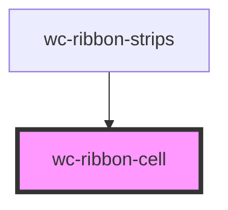

# wc-ribbon-cell

<!-- Auto Generated Below -->

## Properties

| Property           | Attribute        | Description | Type            | Default                         |
| ------------------ | ---------------- | ----------- | --------------- | ------------------------------- |
| `annotationLabels` | --               |             | `string[]`      | `["annotation", "annotations"]` |
| `binaryColor`      | `binary-color`   |             | `boolean`       | `false`                         |
| `classLabels`      | --               |             | `string[]`      | `["term", "terms"]`             |
| `colorBy`          | `color-by`       |             | `any`           | `COLOR_BY.CLASS_COUNT`          |
| `group`            | --               |             | `RibbonGroup`   | `undefined`                     |
| `maxColor`         | --               |             | `number[]`      | `[24, 73, 180]`                 |
| `maxHeatLevel`     | `max-heat-level` |             | `number`        | `48`                            |
| `minColor`         | --               |             | `number[]`      | `[255, 255, 255]`               |
| `selected`         | `selected`       |             | `boolean`       | `false`                         |
| `subject`          | --               |             | `RibbonSubject` | `undefined`                     |

## Dependencies

### Used by

 - [wc-ribbon-strips](../ribbon-strips)

### Graph

----------------------------------------------

*Built with [StencilJS](https://stenciljs.com/)*
