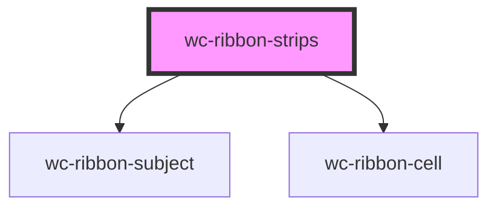

# wc-ribbon-strips

<!-- Auto Generated Below -->

## Properties

| Property                | Attribute                   | Description                                                                                                                                                                                                                                                      | Type          | Default                                               |
| ----------------------- | --------------------------- | ---------------------------------------------------------------------------------------------------------------------------------------------------------------------------------------------------------------------------------------------------------------- | ------------- | ----------------------------------------------------- |
| `addCellAll`            | `add-cell-all`              | add a cell at the beginning of each row/subject to show all annotations                                                                                                                                                                                          | `boolean`     | `true`                                                |
| `annotationLabels`      | `annotation-labels`         |                                                                                                                                                                                                                                                                  | `string`      | `"annotation,annotations"`                            |
| `baseApiUrl`            | `base-api-url`              |                                                                                                                                                                                                                                                                  | `string`      | `"https://api.geneontology.org/api/ontology/ribbon/"` |
| `binaryColor`           | `binary-color`              | false = show a gradient of colors to indicate the value of a cell true = show only two colors (minColor; maxColor) to indicate the values of a cell                                                                                                              | `boolean`     | `false`                                               |
| `categoryAllStyle`      | `category-all-style`        | 0 = Normal 1 = Bold                                                                                                                                                                                                                                              | `any`         | `FONT_STYLE.NORMAL`                                   |
| `categoryCase`          | `category-case`             | Override of the category case 0 (default) = unchanged 1 = to lower case 2 = to upper case                                                                                                                                                                        | `any`         | `FONT_CASE.LOWER_CASE`                                |
| `categoryOtherStyle`    | `category-other-style`      | 0 = Normal 1 = Bold                                                                                                                                                                                                                                              | `any`         | `FONT_STYLE.NORMAL`                                   |
| `classLabels`           | `class-labels`              |                                                                                                                                                                                                                                                                  | `string`      | `"term,terms"`                                        |
| `colorBy`               | `color-by`                  | Which value to base the cell color on 0 = class count 1 = annotation count                                                                                                                                                                                       | `any`         | `COLOR_BY.ANNOTATION_COUNT`                           |
| `data`                  | `data`                      | if provided, will override any value provided in subjects and subset                                                                                                                                                                                             | `string`      | `undefined`                                           |
| `fireEventOnEmptyCells` | `fire-event-on-empty-cells` | If true, the ribbon will fire an event if a user click an empty cell If false, the ribbon will not fire the event on an empty cell Note: if selectionMode == SELECTION.COLUMN, then the event will trigger if at least one of the selected cells has annotations | `boolean`     | `false`                                               |
| `groupBaseUrl`          | `group-base-url`            |                                                                                                                                                                                                                                                                  | `string`      | `"http://amigo.geneontology.org/amigo/term/"`         |
| `groupClickable`        | `group-clickable`           |                                                                                                                                                                                                                                                                  | `boolean`     | `true`                                                |
| `groupMaxLabelSize`     | `group-max-label-size`      |                                                                                                                                                                                                                                                                  | `number`      | `60`                                                  |
| `groupNewTab`           | `group-new-tab`             |                                                                                                                                                                                                                                                                  | `boolean`     | `true`                                                |
| `maxColor`              | `max-color`                 |                                                                                                                                                                                                                                                                  | `string`      | `"24,73,180"`                                         |
| `maxHeatLevel`          | `max-heat-level`            |                                                                                                                                                                                                                                                                  | `number`      | `48`                                                  |
| `minColor`              | `min-color`                 |                                                                                                                                                                                                                                                                  | `string`      | `"255,255,255"`                                       |
| `ribbonSummary`         | --                          |                                                                                                                                                                                                                                                                  | `RibbonModel` | `undefined`                                           |
| `selected`              | `selected`                  | If no value is provided, the ribbon will load without any group selected. If a value is provided, the ribbon will show the requested group as selected The value should be the id of the group to be selected                                                    | `any`         | `undefined`                                           |
| `selectionMode`         | `selection-mode`            | Click handling of a cell.  0 = select only the cell (1 subject, 1 group) 1 = select the whole column (all subjects, 1 group)                                                                                                                                     | `any`         | `SELECTION.CELL`                                      |
| `showOtherGroup`        | `show-other-group`          |                                                                                                                                                                                                                                                                  | `boolean`     | `false`                                               |
| `subjectBaseUrl`        | `subject-base-url`          |                                                                                                                                                                                                                                                                  | `string`      | `"http://amigo.geneontology.org/amigo/gene_product/"` |
| `subjectOpenNewTab`     | `subject-open-new-tab`      |                                                                                                                                                                                                                                                                  | `boolean`     | `true`                                                |
| `subjectPosition`       | `subject-position`          | Position the subject label of each row 0 = None 1 = Left 2 = Right 3 = Bottom                                                                                                                                                                                    | `any`         | `POSITION.LEFT`                                       |
| `subjectUseTaxonIcon`   | `subject-use-taxon-icon`    |                                                                                                                                                                                                                                                                  | `boolean`     | `undefined`                                           |
| `subjects`              | `subjects`                  | provide gene ids (e.g. RGD:620474,RGD:3889 or as a list ["RGD:620474", "RGD:3889"])                                                                                                                                                                              | `string`      | `undefined`                                           |
| `subset`                | `subset`                    |                                                                                                                                                                                                                                                                  | `string`      | `"goslim_agr"`                                        |
| `updateOnSubjectChange` | `update-on-subject-change`  | When this is set to false, changing the subjects Prop won't trigger the reload of the ribbon This is necessary when the ribbon is showing data other than GO or not using the internal fetchData mechanism                                                       | `boolean`     | `true`                                                |

## Events

| Event        | Description                                                         | Type               |
| ------------ | ------------------------------------------------------------------- | ------------------ |
| `cellClick`  | This event is triggered whenever a ribbon cell is clicked           | `CustomEvent<any>` |
| `cellEnter`  | This event is triggered whenever the mouse enters a cell area       | `CustomEvent<any>` |
| `cellLeave`  | This event is triggered whenever the mouse leaves a cell area       | `CustomEvent<any>` |
| `groupClick` | This event is triggered whenever a group cell is clicked            | `CustomEvent<any>` |
| `groupEnter` | This event is triggered whenever the mouse enters a group cell area | `CustomEvent<any>` |
| `groupLeave` | This event is triggered whenever the mouse leaves a group cell area | `CustomEvent<any>` |

## Methods

### `selectGroup(group_id: any) => Promise<void>`

#### Returns

Type: `Promise<void>`

## Dependencies

### Depends on

- [wc-ribbon-subject](../ribbon-subject)
- [wc-ribbon-cell](../ribbon-cell)

### Graph

----------------------------------------------

*Built with [StencilJS](https://stenciljs.com/)*
