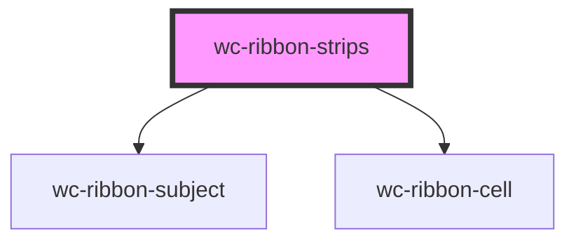

# wc-ribbon-strips

<!-- Auto Generated Below -->

## Properties

| Property              | Attribute                | Description                                                                                                                  | Type          | Default                                               |
| --------------------- | ------------------------ | ---------------------------------------------------------------------------------------------------------------------------- | ------------- | ----------------------------------------------------- |
| `addCellAll`          | `add-cell-all`           | add a cell at the beginning of each row/subject to show all annotations                                                      | `boolean`     | `true`                                                |
| `annotationLabels`    | --                       |                                                                                                                              | `string[]`    | `["annotation", "annotations"]`                       |
| `baseApiUrl`          | `base-api-url`           |                                                                                                                              | `string`      | `"http://api.geneontology.org/api/ontology/ribbon/"`  |
| `binaryColor`         | `binary-color`           |                                                                                                                              | `boolean`     | `false`                                               |
| `classLabels`         | --                       |                                                                                                                              | `string[]`    | `["term", "terms"]`                                   |
| `colorBy`             | `color-by`               |                                                                                                                              | `any`         | `COLOR_BY.ANNOTATION_COUNT`                           |
| `data`                | `data`                   | if provided, will override any value provided in subjects and subset                                                         | `string`      | `undefined`                                           |
| `groupBaseUrl`        | `group-base-url`         |                                                                                                                              | `string`      | `"http://amigo.geneontology.org/amigo/term/"`         |
| `groupClickable`      | `group-clickable`        |                                                                                                                              | `boolean`     | `true`                                                |
| `groupMaxLabelSize`   | `group-max-label-size`   |                                                                                                                              | `number`      | `60`                                                  |
| `groupNewTab`         | `group-new-tab`          |                                                                                                                              | `boolean`     | `true`                                                |
| `maxColor`            | --                       |                                                                                                                              | `number[]`    | `[24, 73, 180]`                                       |
| `maxHeatLevel`        | `max-heat-level`         |                                                                                                                              | `number`      | `48`                                                  |
| `minColor`            | --                       |                                                                                                                              | `number[]`    | `[255, 255, 255]`                                     |
| `ribbonSummary`       | --                       |                                                                                                                              | `RibbonModel` | `undefined`                                           |
| `selectionMode`       | `selection-mode`         | Click handling of a cell.  0 = select only the cell (1 subject, 1 group) 1 = select the whole column (all subjects, 1 group) | `any`         | `SELECTION.COLUMN`                                    |
| `subjectBaseUrl`      | `subject-base-url`       |                                                                                                                              | `string`      | `"http://amigo.geneontology.org/amigo/gene_product/"` |
| `subjectOpenNewTab`   | `subject-open-new-tab`   |                                                                                                                              | `boolean`     | `true`                                                |
| `subjectPosition`     | `subject-position`       | Position the subject label of each row 0 = None 1 = Left 2 = Right 3 = Bottom                                                | `any`         | `POSITION.LEFT`                                       |
| `subjectUseTaxonIcon` | `subject-use-taxon-icon` |                                                                                                                              | `boolean`     | `undefined`                                           |
| `subjects`            | `subjects`               | provide gene ids (e.g. RGD:620474,RGD:3889 or as a list ["RGD:620474", "RGD:3889"])                                          | `string`      | `undefined`                                           |
| `subset`              | `subset`                 |                                                                                                                              | `string`      | `"goslim_agr"`                                        |

## Events

| Event        | Description | Type               |
| ------------ | ----------- | ------------------ |
| `cellClick`  |             | `CustomEvent<any>` |
| `cellEnter`  |             | `CustomEvent<any>` |
| `cellLeave`  |             | `CustomEvent<any>` |
| `groupClick` |             | `CustomEvent<any>` |

## Dependencies

### Depends on

- [wc-ribbon-subject](../ribbon-subject)
- [wc-ribbon-cell](../ribbon-cell)

### Graph

----------------------------------------------

*Built with [StencilJS](https://stenciljs.com/)*
