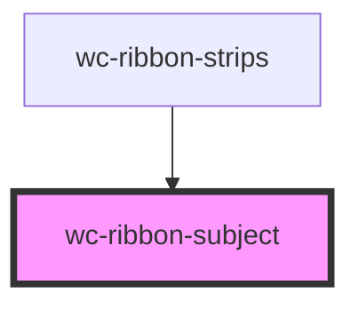

# wc-ribbon-subject

<!-- Auto Generated Below -->

## Properties

| Property         | Attribute            | Description | Type                                                                                                                              | Default     |
| ---------------- | -------------------- | ----------- | --------------------------------------------------------------------------------------------------------------------------------- | ----------- |
| `newTab`         | `new-tab`            |             | `boolean`                                                                                                                         | `undefined` |
| `subject`        | --                   |             | `{ id: string; label: string; taxon_id: string; taxon_label: string; nb_classes: number; nb_annotations: number; groups: [{}]; }` | `undefined` |
| `subjectBaseURL` | `subject-base-u-r-l` |             | `string`                                                                                                                          | `undefined` |

## Dependencies

### Used by

 - [wc-ribbon-strips](../ribbon-strips)

### Graph

----------------------------------------------

*Built with [StencilJS](https://stenciljs.com/)*
